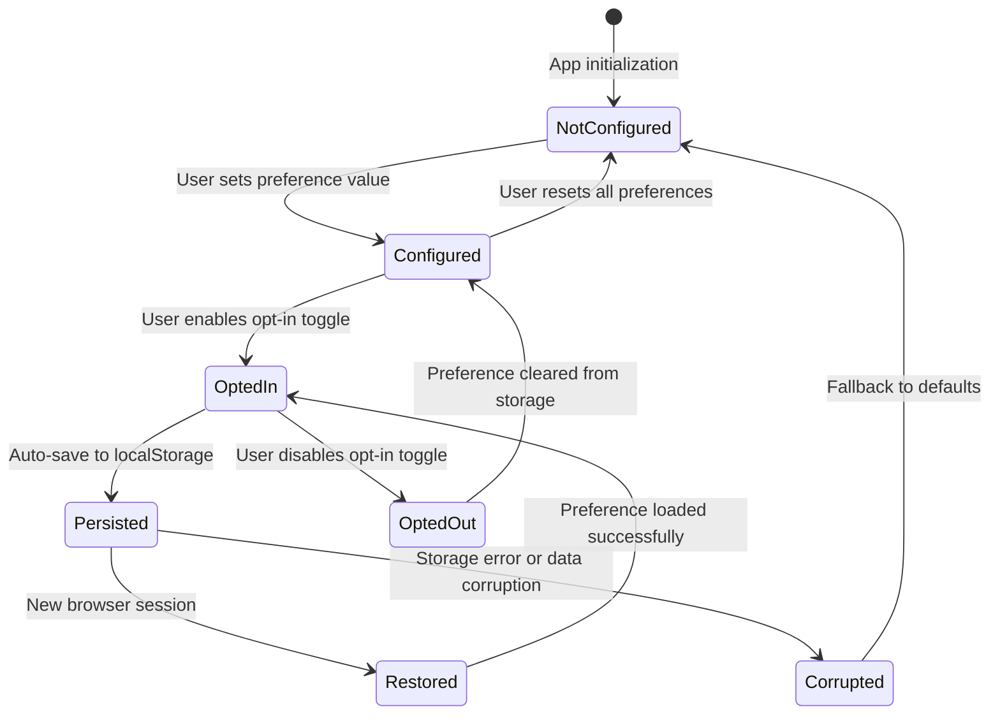

# Data Model: User Preference Management System

**Feature**: 012-user-preference-management
**Created**: 2025-10-13
**Source**: Extracted from spec.md (lines 147-173) and clarifications

---

## Overview

This data model defines the entities and relationships for managing user preferences in a privacy-first, browser-local storage system. All data persists exclusively in browser localStorage with a 5KB total storage limit.

---

## Core Entities

### 1. PreferenceCategory (Enum)

**Purpose**: Defines the distinct categories of user preferences that can be saved and restored.

**Type Definition**:

```typescript
enum PreferenceCategory {
  Timezone = 'timezone',
  PaydayDates = 'payday_dates',
  BusinessDaySettings = 'business_day_settings',
  CurrencyFormat = 'currency_format',
  Locale = 'locale'
}
```

**Validation Rules**:
- Must be one of the five defined enum values
- Case-sensitive string matching

**Storage Representation**: String enum value (e.g., "timezone")

**Relationship**: Key in `PreferenceCollection.preferences` Map

---

### 2. UserPreference<T>

**Purpose**: Represents a single user's saved configuration choice for a specific preference category.

**Source**: spec.md lines 152-156

**Type Definition**:

```typescript
interface UserPreference<T = unknown> {
  category: PreferenceCategory;
  value: T;                      // Type varies by category (see CategoryValue below)
  optInStatus: boolean;          // User consent to save this category
  timestamp: string;             // ISO 8601 datetime of last save
}
```

**Fields**:

| Field | Type | Required | Description | Validation |
|-------|------|----------|-------------|------------|
| `category` | `PreferenceCategory` | Yes | Which preference category this belongs to | Must be valid enum value |
| `value` | `T` (generic) | Yes | The user's configured value | Category-specific validation (see CategoryValue) |
| `optInStatus` | `boolean` | Yes | Whether user consented to persist this preference | Must be boolean |
| `timestamp` | `string` | Yes | ISO 8601 datetime when last saved | Must be valid ISO 8601 format |

**Validation Rules**:
- `category`: Must match one of `PreferenceCategory` enum values
- `value`: Must pass category-specific validation (see CategoryValue type)
- `optInStatus`: If `false`, preference should not be persisted to localStorage
- `timestamp`: Must be valid ISO 8601 string (use `new Date().toISOString()`)

**Storage Size**: ~50-300 bytes depending on value complexity

**Relationship**: Element in `PreferenceCollection.preferences` Map

---

### 3. CategoryValue (Discriminated Union)

**Purpose**: Type-safe representation of values for each preference category with specific validation rules.

**Source**: Derived from spec.md lines 145-163 and clarification Q2

**Type Definition**:

```typescript
type CategoryValue =
  | TimezoneValue
  | PaydayDatesValue
  | BusinessDaySettingsValue
  | CurrencyFormatValue
  | LocaleValue;

// Timezone: IANA timezone identifier
interface TimezoneValue {
  category: PreferenceCategory.Timezone;
  value: string;  // e.g., "America/New_York", "Europe/London", "UTC"
}

// Payday Dates: Flexible pattern supporting specific dates and recurring schedules
interface PaydayDatesValue {
  category: PreferenceCategory.PaydayDates;
  value: PaydayPattern;
}

// Business Day Settings: Rules for working days vs. weekends/holidays
interface BusinessDaySettingsValue {
  category: PreferenceCategory.BusinessDaySettings;
  value: {
    workingDays: number[];      // 0=Sunday, 1=Monday, ..., 6=Saturday
    holidays: string[];          // Array of ISO date strings (e.g., ["2025-12-25"])
  };
}

// Currency Format: Display formatting for monetary amounts
interface CurrencyFormatValue {
  category: PreferenceCategory.CurrencyFormat;
  value: {
    currencyCode: string;        // ISO 4217 code (e.g., "USD", "EUR", "GBP")
    decimalSeparator: '.' | ',';
    thousandsSeparator: ',' | '.' | ' ' | '';
    symbolPosition: 'before' | 'after';
  };
}

// Locale: Language/region setting
interface LocaleValue {
  category: PreferenceCategory.Locale;
  value: string;  // BCP 47 language tag (e.g., "en-US", "en-GB", "es-MX")
}
```

**Validation Rules by Category**:

#### Timezone
- **Format**: IANA timezone database identifier
- **Validation**: Must be valid timezone from luxon's list (use `DateTime.local({ zone: value }).isValid`)
- **Examples**: "America/New_York", "Europe/London", "Asia/Tokyo", "UTC"
- **Invalid**: "EST", "PST" (abbreviations not allowed), arbitrary strings
- **Size**: 20-40 bytes

#### Payday Dates
- **Format**: `PaydayPattern` (see below)
- **Validation**: Pattern-specific rules (see PaydayPattern section)
- **Examples**: `{type: 'specific', dates: [1, 15]}`, `{type: 'weekly', dayOfWeek: 5}`
- **Size**: 50-150 bytes

#### Business Day Settings
- **Format**: Object with `workingDays` and `holidays` arrays
- **Validation**:
  - `workingDays`: Array of integers 0-6, no duplicates, at least 1 working day
  - `holidays`: Array of valid ISO date strings (YYYY-MM-DD format)
- **Examples**: `{workingDays: [1,2,3,4,5], holidays: ["2025-12-25", "2025-01-01"]}`
- **Invalid**: Empty `workingDays`, invalid date formats, duplicate days
- **Size**: 50-500 bytes (depends on holiday count)

#### Currency Format
- **Format**: Object with currency code and formatting rules
- **Validation**:
  - `currencyCode`: Must be valid ISO 4217 code (3 uppercase letters)
  - `decimalSeparator` and `thousandsSeparator` must be different (unless thousandsSeparator is empty)
  - `symbolPosition`: Must be 'before' or 'after'
- **Examples**: `{currencyCode: "USD", decimalSeparator: ".", thousandsSeparator: ",", symbolPosition: "before"}`
- **Invalid**: Made-up currency codes, same separators, invalid positions
- **Size**: ~100 bytes

#### Locale
- **Format**: BCP 47 language tag
- **Validation**: Must match BCP 47 format (language-region, e.g., "en-US")
- **Examples**: "en-US", "en-GB", "es-MX", "fr-CA"
- **Invalid**: "English", "USA", single letters
- **Size**: 5-10 bytes

---

### 4. PaydayPattern (Discriminated Union)

**Purpose**: Flexible representation of payday schedules supporting both specific dates and recurring patterns.

**Source**: research.md Section 4 (payroll schedule patterns)

**Type Definition**:

```typescript
type PaydayPattern =
  | SpecificDatesPattern
  | WeeklyPattern
  | BiweeklyPattern
  | MonthlyPattern;

// Semi-monthly: Specific days of month (e.g., 1st and 15th)
interface SpecificDatesPattern {
  type: 'specific';
  dates: number[];  // Array of day-of-month (1-31)
}

// Weekly: Every week on specific day
interface WeeklyPattern {
  type: 'weekly';
  dayOfWeek: number;  // 0=Sunday, 1=Monday, ..., 6=Saturday
}

// Biweekly: Every two weeks on specific day
interface BiweeklyPattern {
  type: 'biweekly';
  startDate: string;   // ISO date string for first payday
  dayOfWeek: number;   // 0=Sunday, 1=Monday, ..., 6=Saturday
}

// Monthly: Specific day of each month
interface MonthlyPattern {
  type: 'monthly';
  dayOfMonth: number;  // 1-31
}
```

**Validation Rules**:

#### SpecificDatesPattern (Semi-monthly)
- **18% of payrolls** (research.md)
- `dates` array must:
  - Contain 1-4 numbers (typical: 2 for semi-monthly)
  - Each number must be 1-31
  - No duplicates
  - Sorted in ascending order
- **Edge case**: Day 31 is invalid for months with fewer days (handle with luxon `endOf('month')`)
- **Examples**:
  - `{type: 'specific', dates: [1, 15]}` - 1st and 15th
  - `{type: 'specific', dates: [15]}` - 15th only (monthly on 15th, alternative to MonthlyPattern)

#### WeeklyPattern
- **31.8% of payrolls** (research.md)
- `dayOfWeek` must be integer 0-6
- **Examples**:
  - `{type: 'weekly', dayOfWeek: 5}` - Every Friday
  - `{type: 'weekly', dayOfWeek: 1}` - Every Monday

#### BiweeklyPattern
- **45.7% of payrolls (most common)** (research.md)
- `startDate` must be valid ISO date string (YYYY-MM-DD)
- `dayOfWeek` must be integer 0-6
- `startDate` must fall on the specified `dayOfWeek` (validate with luxon)
- **Examples**:
  - `{type: 'biweekly', startDate: '2025-10-10', dayOfWeek: 5}` - Every other Friday starting Oct 10
  - `{type: 'biweekly', startDate: '2025-01-06', dayOfWeek: 1}` - Every other Monday starting Jan 6

#### MonthlyPattern
- **4.4% of payrolls** (research.md)
- `dayOfMonth` must be 1-31
- **Edge case**: Handle month-end overflow (e.g., Feb 31 → Feb 28/29) with luxon
- **Examples**:
  - `{type: 'monthly', dayOfMonth: 1}` - 1st of every month
  - `{type: 'monthly', dayOfMonth: 31}` - Last day of every month (with month-end handling)

**Storage Size**: 50-150 bytes per pattern

---

### 5. PreferenceCollection

**Purpose**: Top-level container for all user preferences with metadata and size tracking.

**Type Definition**:

```typescript
interface PreferenceCollection {
  version: string;                                      // Schema version (e.g., "1.0.0")
  preferences: Map<PreferenceCategory, UserPreference>; // All saved preferences
  totalSize: number;                                    // Computed size in bytes
  lastModified: string;                                 // ISO 8601 datetime
}
```

**Fields**:

| Field | Type | Required | Description | Validation |
|-------|------|----------|-------------|------------|
| `version` | `string` | Yes | Schema version for forward compatibility | Semantic versioning (e.g., "1.0.0") |
| `preferences` | `Map<PreferenceCategory, UserPreference>` | Yes | All user preferences keyed by category | Max 5 entries (one per category) |
| `totalSize` | `number` | Yes | Total storage size in bytes | Must be <5120 bytes (5KB limit) |
| `lastModified` | `string` | Yes | When collection was last updated | ISO 8601 format |

**Validation Rules**:
- `version`: Must match current schema version (start with "1.0.0")
- `preferences`: Map keys must match `UserPreference.category` values
- `totalSize`: Must be ≤5120 bytes (FR-014: 5KB storage limit)
  - Calculate with: `new Blob([JSON.stringify(preferences)]).size`
- `lastModified`: Updated on every save operation

**Serialization**:
- Serialize Map to object for JSON storage: `Object.fromEntries(preferences)`
- Deserialize back to Map: `new Map(Object.entries(storedObject))`

**Storage Key**: `payplan_preferences_v1` (localStorage key)

**Storage Size**: Total of all preferences + ~50 bytes overhead

**Lifecycle**:
1. **Load**: Deserialize from localStorage, validate schema version
2. **Validate**: Check `totalSize` <5KB, validate each preference
3. **Update**: Modify individual preferences, recalculate `totalSize`
4. **Save**: Serialize to JSON, store in localStorage

---

## Validation Schemas (Zod)

**Purpose**: Runtime validation using Zod library (already in dependencies: zod 4.1.11)

**Implementation Approach**:

```typescript
import { z } from 'zod';
import { DateTime } from 'luxon';

// Timezone validation
const timezoneSchema = z.string().refine(
  (tz) => DateTime.local({ zone: tz }).isValid,
  { message: 'Invalid IANA timezone identifier' }
);

// Payday pattern validation
const specificDatesPatternSchema = z.object({
  type: z.literal('specific'),
  dates: z.array(z.number().int().min(1).max(31)).min(1).max(4)
});

const weeklyPatternSchema = z.object({
  type: z.literal('weekly'),
  dayOfWeek: z.number().int().min(0).max(6)
});

const biweeklyPatternSchema = z.object({
  type: z.literal('biweekly'),
  startDate: z.string().regex(/^\d{4}-\d{2}-\d{2}$/),
  dayOfWeek: z.number().int().min(0).max(6)
}).refine(
  (pattern) => {
    const date = DateTime.fromISO(pattern.startDate);
    return date.isValid && date.weekday % 7 === pattern.dayOfWeek;
  },
  { message: 'startDate must fall on the specified dayOfWeek' }
);

const monthlyPatternSchema = z.object({
  type: z.literal('monthly'),
  dayOfMonth: z.number().int().min(1).max(31)
});

const paydayPatternSchema = z.discriminatedUnion('type', [
  specificDatesPatternSchema,
  weeklyPatternSchema,
  biweeklyPatternSchema,
  monthlyPatternSchema
]);

// Business day settings validation
const businessDaySettingsSchema = z.object({
  workingDays: z.array(z.number().int().min(0).max(6)).min(1).max(7),
  holidays: z.array(z.string().regex(/^\d{4}-\d{2}-\d{2}$/))
});

// Currency format validation
const currencyFormatSchema = z.object({
  currencyCode: z.string().regex(/^[A-Z]{3}$/),
  decimalSeparator: z.enum(['.', ',']),
  thousandsSeparator: z.enum([',', '.', ' ', '']),
  symbolPosition: z.enum(['before', 'after'])
}).refine(
  (fmt) => fmt.decimalSeparator !== fmt.thousandsSeparator || fmt.thousandsSeparator === '',
  { message: 'Decimal and thousands separators must be different' }
);

// Locale validation
const localeSchema = z.string().regex(/^[a-z]{2}-[A-Z]{2}$/);

// UserPreference validation
const userPreferenceSchema = z.object({
  category: z.nativeEnum(PreferenceCategory),
  value: z.unknown(), // Type-specific validation applied separately
  optInStatus: z.boolean(),
  timestamp: z.string().datetime()
});

// PreferenceCollection validation
const preferenceCollectionSchema = z.object({
  version: z.string().regex(/^\d+\.\d+\.\d+$/),
  preferences: z.record(z.nativeEnum(PreferenceCategory), userPreferenceSchema),
  totalSize: z.number().int().max(5120), // 5KB limit
  lastModified: z.string().datetime()
});
```

---

## State Transitions

### Preference Lifecycle



**State Definitions**:
1. **NotConfigured**: No value set, using application default
2. **Configured**: Value set in current session, not yet persisted (opt-in not enabled)
3. **OptedIn**: User consented to persist, value set
4. **Persisted**: Saved to localStorage successfully
5. **Restored**: Loaded from localStorage in new session
6. **OptedOut**: User disabled persistence, value remains in session only
7. **Corrupted**: Storage data invalid or unreadable, fallback to defaults

---

## Storage Format Example

**localStorage key**: `payplan_preferences_v1`

**Serialized JSON**:

```json
{
  "version": "1.0.0",
  "preferences": {
    "timezone": {
      "category": "timezone",
      "value": "America/New_York",
      "optInStatus": true,
      "timestamp": "2025-10-13T14:30:00.000Z"
    },
    "payday_dates": {
      "category": "payday_dates",
      "value": {
        "type": "biweekly",
        "startDate": "2025-10-10",
        "dayOfWeek": 5
      },
      "optInStatus": true,
      "timestamp": "2025-10-13T14:32:15.000Z"
    },
    "currency_format": {
      "category": "currency_format",
      "value": {
        "currencyCode": "USD",
        "decimalSeparator": ".",
        "thousandsSeparator": ",",
        "symbolPosition": "before"
      },
      "optInStatus": true,
      "timestamp": "2025-10-13T14:35:00.000Z"
    }
  },
  "totalSize": 487,
  "lastModified": "2025-10-13T14:35:00.000Z"
}
```

**Storage size**: ~487 bytes (well under 5KB limit)

---

## Application Defaults

When no preference is saved or after reset (FR-004):

| Category | Default Value | Rationale |
|----------|---------------|-----------|
| **Timezone** | Browser-detected timezone (via `Intl.DateTimeFormat().resolvedOptions().timeZone`) | Provides best UX out-of-box |
| **Payday Dates** | `null` (empty) | User must configure explicitly (no universal default) |
| **Business Day Settings** | `{workingDays: [1,2,3,4,5], holidays: []}` | Standard Mon-Fri workweek |
| **Currency Format** | `{currencyCode: "USD", decimalSeparator: ".", thousandsSeparator: ",", symbolPosition: "before"}` | US standard format |
| **Locale** | `"en-US"` | English (United States) as baseline |

---

## Summary

**Total Entities**: 5 core + 4 payday pattern variants = 9 data structures
**Storage Limit**: 5120 bytes (5KB) enforced by FR-014
**Validation**: Zod schemas for runtime type safety
**Serialization**: JSON with Map ↔ Object conversion
**Versioning**: Schema version field for future migrations

**Next Phase**: contracts/ (API contracts for services and components)
