# Implementation Plan: Realign PayPlan Specs to Modular Extraction Architecture

**Branch**: `002-realign-payplan-specs`
**Created**: 2025-10-07
**Status**: Planning
**Estimated Duration**: 3-4 hours (6-8 atomic tasks @ ≤60 min each)

---

## Executive Summary

This plan realigns all PayPlan specification documents to accurately reflect the current modular extraction architecture implemented in v0.1.5-a.2. The work is **documentation-only** with zero runtime changes, zero backend edits, and zero behavior modifications.

### Key Objectives
1. **Update stale path references** across 29 spec documents
2. **Create migration documentation** (`ops/deltas/0013_realignment.md`)
3. **Add CI performance gates** (50 emails <2s, artifact upload, Swagger lazy-load)
4. **Document UI enhancements** (confidence legend component + CSV documentation)

### Impact
- **Developer Experience**: Accurate documentation for navigation and onboarding
- **Spec Integrity**: All paths match actual codebase structure
- **CI Quality**: Automated performance regression prevention
- **User Clarity**: Better understanding of confidence scores

---

## Phase 0: Discovery & Inventory

### Stale References Identified

**Old Architecture** (pre-v0.1.5-a.2):
```
frontend/src/lib/
├── email-extractor.ts        ❌ Now: extraction/core wrapper
├── provider-detectors.ts     ❌ Deleted → extraction/providers/
├── date-parser.ts           ❌ Now: extraction/extractors/date.ts
└── redact.ts                ❌ Now: extraction/helpers/redaction.ts
```

**Current Architecture** (v0.1.5-a.2+):
```
frontend/src/lib/extraction/
├── providers/
│   ├── detector.ts          ✅ Provider detection logic
│   └── patterns.ts          ✅ Regex patterns for providers
├── extractors/
│   ├── amount.ts            ✅ Amount extraction
│   ├── autopay.ts           ✅ Autopay detection
│   ├── currency.ts          ✅ Currency detection
│   ├── date.ts              ✅ Date parsing & normalization
│   ├── installment.ts       ✅ Installment number extraction
│   └── late-fee.ts          ✅ Late fee extraction
└── helpers/
    ├── cache.ts             ✅ LRU caching (230-875x perf)
    ├── confidence-calculator.ts ✅ Confidence scoring
    ├── domain-validator.ts  ✅ Email domain validation
    ├── date-detector.ts     ✅ Date format detection
    ├── date-reparser.ts     ✅ Date reparsing logic
    ├── error-sanitizer.ts   ✅ Error message sanitization
    ├── timezone.ts          ✅ Timezone handling
    ├── field-extractor.ts   ✅ Field extraction utilities
    ├── regex-profiler.ts    ✅ Regex performance profiling
    └── redaction.ts         ✅ PII redaction

frontend/tests/              ✅ Test suite reorganization
├── unit/                    ✅ 30+ unit tests
├── integration/             ✅ Cache + quick-fix flow tests
├── performance/             ✅ Benchmark tests
└── fixtures/                ✅ Shared test data
```

### Files Requiring Updates

**High Priority** (direct module references):
1. `specs/inbox-paste/tasks.md` - 18 stale references
2. `specs/inbox-paste/plan.md` - 3 stale references
3. `specs/001-inbox-paste-phase/tasks.md` - 27 stale references
4. `specs/001-inbox-paste-phase/data-model.md` - 7 stale references
5. `specs/001-inbox-paste-phase/research.md` - 7 stale references
6. `specs/v0.1.5-rescue/tasks.md` - 5 stale references
7. `specs/v0.1.5-rescue/tasks-a2.md` - 3 stale references
8. `specs/v0.1.5-rescue/review-analysis-a2.md` - 1 stale reference

**Medium Priority** (test path references):
9. All specs referencing `tests/unit/` → should reference `frontend/tests/unit/`
10. All specs referencing `tests/integration/` → should reference `frontend/tests/integration/`

**Low Priority** (context/background):
11. `specs/bnpl-manager/` - May contain indirect references
12. `specs/api-hardening/` - May reference testing structure
13. `specs/public-deployment/` - May reference build/test paths

### Risk Assessment

**Risks**:
- ⚠️ **Stale documentation confusion**: Developers may navigate to non-existent files
- ⚠️ **CI gaps**: No performance regression detection
- ⚠️ **User confusion**: Confidence scores not documented

**Mitigation**:
- ✅ **Systematic path mapping**: Delta file provides bidirectional lookup
- ✅ **Automated CI gates**: Prevent performance regressions
- ✅ **Clear rollback**: Git revert of branch (no code changes)

### Rollback Plan

If issues arise:
```bash
# Clean rollback - no runtime impact
git checkout main
git branch -D 002-realign-payplan-specs

# Specs remain at v0.1.5-a.2 state
# All code continues functioning normally
```

---

## Phase 1: Design & Structure

### 1.1 Documentation Structure Changes

**New Files to Create**:
```
specs/realignment/
├── plan.md              ← This file
└── tasks.md             ← Atomic task breakdown

ops/deltas/
└── 0013_realignment.md  ← Migration guide (old→new paths)
```

**Files to Update** (29 total):
```
specs/inbox-paste/{tasks,plan}.md
specs/001-inbox-paste-phase/{tasks,data-model,research}.md
specs/v0.1.5-rescue/{tasks,tasks-a2,review-analysis-a2}.md
```

### 1.2 Path Migration Mapping

**Provider Detection**:
| Old Path | New Path | Rationale |
|----------|----------|-----------|
| `frontend/src/lib/provider-detectors.ts` | `frontend/src/lib/extraction/providers/detector.ts` | Modular separation of provider logic |
| N/A | `frontend/src/lib/extraction/providers/patterns.ts` | Extracted regex patterns for maintainability |

**Extractors** (field-specific extraction):
| Old Path | New Path | Rationale |
|----------|----------|-----------|
| `frontend/src/lib/date-parser.ts` | `frontend/src/lib/extraction/extractors/date.ts` | Dedicated extractor module |
| N/A | `frontend/src/lib/extraction/extractors/amount.ts` | New: amount extraction logic |
| N/A | `frontend/src/lib/extraction/extractors/autopay.ts` | New: autopay detection logic |
| N/A | `frontend/src/lib/extraction/extractors/currency.ts` | New: currency detection logic |
| N/A | `frontend/src/lib/extraction/extractors/installment.ts` | New: installment extraction logic |
| N/A | `frontend/src/lib/extraction/extractors/late-fee.ts` | New: late fee extraction logic |

**Helpers** (shared utilities):
| Old Path | New Path | Rationale |
|----------|----------|-----------|
| `frontend/src/lib/redact.ts` | `frontend/src/lib/extraction/helpers/redaction.ts` | Standardized naming + grouping |
| N/A | `frontend/src/lib/extraction/helpers/cache.ts` | New: LRU cache (230-875x perf gain) |
| N/A | `frontend/src/lib/extraction/helpers/confidence-calculator.ts` | New: confidence scoring logic |
| N/A | `frontend/src/lib/extraction/helpers/domain-validator.ts` | New: email domain validation |
| N/A | `frontend/src/lib/extraction/helpers/date-detector.ts` | New: date format detection |
| N/A | `frontend/src/lib/extraction/helpers/date-reparser.ts` | New: date reparsing utilities |
| N/A | `frontend/src/lib/extraction/helpers/error-sanitizer.ts` | New: error sanitization |
| N/A | `frontend/src/lib/extraction/helpers/timezone.ts` | New: timezone handling |
| N/A | `frontend/src/lib/extraction/helpers/field-extractor.ts` | New: field extraction utilities |
| N/A | `frontend/src/lib/extraction/helpers/regex-profiler.ts` | New: regex performance profiling |

**Core Wrapper**:
| Old Path | New Path | Rationale |
|----------|----------|-----------|
| `frontend/src/lib/email-extractor.ts` (monolithic) | `frontend/src/lib/email-extractor.ts` (orchestrator) | Now imports from extraction/* modules |

**Tests**:
| Old Path | New Path | Rationale |
|----------|----------|-----------|
| `tests/unit/*.test.js` | `frontend/tests/unit/*.test.ts` | Moved to frontend/, TypeScript conversion |
| `tests/integration/*.test.js` | `frontend/tests/integration/*.test.ts` | Moved to frontend/, TypeScript conversion |
| N/A | `frontend/tests/performance/*.test.ts` | New: performance benchmarks |
| N/A | `frontend/tests/fixtures/*.ts` | New: shared test data |

### 1.3 CI Gates Design

**Performance Gate Specification**:
```yaml
# .github/workflows/perf-gate.yml (reference - not created in this task)
name: Performance Gate
on: [pull_request, push]

jobs:
  benchmark:
    runs-on: ubuntu-latest
    steps:
      - uses: actions/checkout@v4
      - uses: actions/setup-node@v4
        with:
          node-version: '20'
      - run: npm ci --prefix frontend

      # Gate 1: Extraction Performance (50 emails <2s)
      - name: Run extraction benchmarks
        run: npm run test:perf --prefix frontend

      # Gate 2: Verify Swagger lazy-loading (bundle size check)
      - name: Check bundle size
        run: |
          npm run build --prefix frontend
          # Verify SwaggerUI is code-split (not in main bundle)
          if grep -q "SwaggerUI" frontend/dist/assets/index*.js; then
            echo "❌ SwaggerUI not lazy-loaded!"
            exit 1
          fi

      # Artifact Upload
      - name: Upload benchmark results
        uses: actions/upload-artifact@v4
        with:
          name: perf-benchmarks
          path: frontend/perf-results.json
```

**Performance Thresholds**:
- ✅ **50 emails < 2000ms** (with cache: ~50-200ms expected)
- ✅ **Swagger lazy-load**: SwaggerUI not in main bundle
- ✅ **Artifact upload**: Benchmark results for trend analysis

### 1.4 UI/Documentation Enhancements

**Confidence Legend Component** (reference only - already exists):
```typescript
// frontend/src/components/ConfidenceLegend.tsx (reference)
// Displayed on results page to explain confidence scores
```

**CSV Documentation Line** (to add):
```markdown
# CSV Export Format

The exported CSV includes the following columns:
- provider: BNPL provider name
- installment_no: Installment number
- due_date: ISO date (YYYY-MM-DD)
- amount: Payment amount
- currency: Currency code (USD, EUR, etc.)
- autopay: Boolean autopay status
- late_fee: Late fee amount (if applicable)
- **confidence: Extraction confidence score (0.0-1.0)**
  - **0.8-1.0**: High confidence (green) - All required fields extracted
  - **0.5-0.8**: Medium confidence (yellow) - Some fields missing or ambiguous
  - **0.0-0.5**: Low confidence (red) - Major extraction issues
```

---

## Phase 2: Atomic Task Breakdown

### Task 2.1: Create Delta Migration Document
**Duration**: 45 min
**File**: `ops/deltas/0013_realignment.md`

**Scope**:
- Complete old→new path mapping table (all 20+ modules)
- Rationale for each architectural change
- Migration timeline (v0.1.3 → v0.1.5-a.2)
- Impact analysis (docs-only, zero runtime change)

**Acceptance**:
- ✅ All extraction modules documented with old→new paths
- ✅ Rationale explains modular separation benefits
- ✅ Clear statement: "No runtime changes, docs-only"

---

### Task 2.2: Update inbox-paste Specs
**Duration**: 40 min
**Files**: `specs/inbox-paste/{tasks,plan}.md`

**Scope**:
- Replace 18 references in tasks.md
- Replace 3 references in plan.md
- Update test path references

**Find/Replace Operations**:
```bash
# Provider detectors
s|frontend/src/lib/provider-detectors.ts|frontend/src/lib/extraction/providers/detector.ts|g

# Date parser
s|frontend/src/lib/date-parser.ts|frontend/src/lib/extraction/extractors/date.ts|g

# Email extractor (note: still exists but now orchestrates)
# Add clarification that it now imports from extraction/* modules

# Redaction
s|frontend/src/lib/redact.ts|frontend/src/lib/extraction/helpers/redaction.ts|g

# Tests
s|tests/unit/|frontend/tests/unit/|g
s|tests/integration/|frontend/tests/integration/|g
```

**Acceptance**:
- ✅ Zero stale path references in both files
- ✅ All paths verified to exist in current codebase
- ✅ Test commands updated to use frontend/tests/**

---

### Task 2.3: Update 001-inbox-paste-phase Specs
**Duration**: 60 min
**Files**: `specs/001-inbox-paste-phase/{tasks,data-model,research}.md`

**Scope**:
- Replace 27 references in tasks.md
- Replace 7 references in data-model.md
- Replace 7 references in research.md
- Update code stubs to reference new module paths

**Special Considerations**:
- `data-model.md` has "Location:" annotations - update with new paths
- `research.md` has architectural discussion - add note about v0.1.5-a.2 modular refactor
- `tasks.md` has test verification commands - update paths

**Acceptance**:
- ✅ All 3 files have accurate module references
- ✅ Code stubs updated with correct import paths
- ✅ "Location:" annotations point to current files
- ✅ Research doc notes architectural evolution

---

### Task 2.4: Update v0.1.5-rescue Specs
**Duration**: 30 min
**Files**: `specs/v0.1.5-rescue/{tasks,tasks-a2,review-analysis-a2}.md`

**Scope**:
- Replace 5 references in tasks.md
- Replace 3 references in tasks-a2.md
- Replace 1 reference in review-analysis-a2.md

**Find/Replace Operations**:
```bash
# Date parser
s|frontend/src/lib/date-parser.ts|frontend/src/lib/extraction/extractors/date.ts|g

# Email extractor (location references)
s|frontend/src/lib/email-extractor.ts:(\d+)|frontend/src/lib/email-extractor.ts:\1 (now orchestrates extraction/* modules)|g
```

**Acceptance**:
- ✅ All path references updated
- ✅ Line number references preserved where applicable
- ✅ Context notes added for orchestrator pattern

---

### Task 2.5: Sweep Remaining Specs for Test Paths
**Duration**: 30 min
**Files**: All other specs (bnpl-manager, api-hardening, public-deployment, business-days)

**Scope**:
- Search for any `tests/` references (without `frontend/` prefix)
- Update to `frontend/tests/`
- Check for indirect module references

**Search Commands**:
```bash
grep -r "tests/unit" specs/ --include="*.md" | grep -v "frontend/tests"
grep -r "tests/integration" specs/ --include="*.md" | grep -v "frontend/tests"
grep -r "provider-detectors" specs/ --include="*.md"
grep -r "date-parser" specs/ --include="*.md"
```

**Acceptance**:
- ✅ All test path references include `frontend/` prefix
- ✅ No stale module references found in sweep
- ✅ Any additional refs updated with correct paths

---

### Task 2.6: Add CI Gates Specification Document
**Duration**: 45 min
**File**: `specs/realignment/ci-gates.md` (new)

**Scope**:
- Document performance gate requirements
- Specify Swagger lazy-load verification
- Define artifact upload format
- Provide example workflow snippet

**Structure**:
```markdown
# CI Performance Gates Specification

## Overview
Automated gates to prevent performance regressions in email extraction.

## Gate 1: Extraction Performance
- **Threshold**: 50 emails processed in <2000ms
- **Test Command**: `npm run test:perf --prefix frontend`
- **Current Performance**: ~50-200ms (with cache enabled)
- **Fail Condition**: >2000ms average across 3 runs

## Gate 2: Swagger Lazy-Loading
- **Requirement**: SwaggerUI must be code-split (not in main bundle)
- **Verification**: Check build output for SwaggerUI in main bundle
- **Fail Condition**: SwaggerUI found in `frontend/dist/assets/index*.js`

## Gate 3: Artifact Upload
- **Artifact Name**: `perf-benchmarks`
- **Format**: JSON with timestamp, metrics, environment
- **Retention**: 90 days
- **Usage**: Trend analysis, regression detection

## Example Workflow
[Include YAML snippet from Phase 1.3]
```

**Acceptance**:
- ✅ All 3 gates documented with thresholds
- ✅ Example workflow provided
- ✅ Current performance baseline noted
- ✅ Failure conditions clearly defined

---

### Task 2.7: Add Confidence Legend Documentation
**Duration**: 20 min
**Files**:
- `specs/realignment/ui-enhancements.md` (new)
- `frontend/README.md` or CSV export docs (update)

**Scope**:
- Document confidence legend component location
- Add CSV column description for confidence scores
- Explain 3-tier confidence system (0.8+, 0.5-0.8, <0.5)

**CSV Docs Update**:
```markdown
## CSV Export Format

Columns:
- `provider`: BNPL provider name (Klarna, Affirm, etc.)
- `installment_no`: Payment installment number
- `due_date`: Payment due date (ISO 8601: YYYY-MM-DD)
- `amount`: Payment amount (decimal)
- `currency`: ISO 4217 currency code (USD, EUR, GBP, etc.)
- `autopay`: Autopay enabled (true/false)
- `late_fee`: Late fee amount if applicable (decimal or 0)
- **`confidence`**: Extraction confidence score (0.0-1.0)
  - **0.8-1.0** (High): All required fields extracted with high certainty
  - **0.5-0.8** (Medium): Some fields missing or extraction uncertain
  - **0.0-0.5** (Low): Major extraction issues, manual review required

See `ConfidenceLegend` component for visual guide.
```

**Acceptance**:
- ✅ Confidence scoring documented in CSV format section
- ✅ Component reference added (`ConfidenceLegend`)
- ✅ 3-tier system explained with thresholds
- ✅ User guidance provided (when to review manually)

---

### Task 2.8: Final Verification & PR Prep
**Duration**: 30 min

**Scope**:
- Run automated path verification
- Verify all created files exist
- Run CI locally (if applicable)
- Prepare PR description

**Verification Script** (conceptual):
```bash
#!/bin/bash
# verify-realignment.sh

echo "Verifying path references..."

# Check for stale references
if grep -r "frontend/src/lib/provider-detectors\.ts" specs/ --include="*.md" | grep -v "002-realign" | grep -v "Old:"; then
  echo "❌ Found stale provider-detectors references"
  exit 1
fi

if grep -r "frontend/src/lib/date-parser\.ts" specs/ --include="*.md" | grep -v "002-realign" | grep -v "Old:"; then
  echo "❌ Found stale date-parser references"
  exit 1
fi

if grep -r "tests/unit/" specs/ --include="*.md" | grep -v "frontend/tests" | grep -v "002-realign"; then
  echo "❌ Found test paths without frontend/ prefix"
  exit 1
fi

echo "✅ All path references verified"

# Verify new files exist
for file in \
  "specs/realignment/plan.md" \
  "specs/realignment/tasks.md" \
  "specs/realignment/ci-gates.md" \
  "specs/realignment/ui-enhancements.md" \
  "ops/deltas/0013_realignment.md"; do
  if [ ! -f "$file" ]; then
    echo "❌ Missing required file: $file"
    exit 1
  fi
done

echo "✅ All required files present"

# Verify no code changes
if git diff main --name-only | grep -E "\.(ts|tsx|js|jsx)$"; then
  echo "❌ Unexpected code changes detected"
  exit 1
fi

echo "✅ No code changes (docs-only verified)"
echo ""
echo "🎉 Realignment verification complete!"
```

**PR Description Template**:
```markdown
## Realign PayPlan Specs to Modular Extraction Architecture

**Type**: Documentation
**Runtime Impact**: None (docs-only)
**Breaking Changes**: None

### Summary
Realigns all specification documents to reflect the modular extraction architecture implemented in v0.1.5-a.2. Updates 29 spec files with correct module paths, adds CI performance gates, and documents UI enhancements.

### Changes
- ✅ 29 spec files updated with current module paths
- ✅ `ops/deltas/0013_realignment.md` created (migration guide)
- ✅ CI gates spec added (50 emails <2s, Swagger lazy-load, artifacts)
- ✅ Confidence legend documented in CSV export guide

### Path Migrations
- `provider-detectors.ts` → `extraction/providers/detector.ts`
- `date-parser.ts` → `extraction/extractors/date.ts`
- `redact.ts` → `extraction/helpers/redaction.ts`
- `tests/` → `frontend/tests/`
- +15 new extraction modules documented

### Verification
- ✅ Zero stale path references
- ✅ All referenced paths exist in codebase
- ✅ No code changes (git diff clean for .ts/.tsx files)
- ✅ CI gates defined with thresholds

### Related
- Closes #[issue-number] (if applicable)
- Follows up on v0.1.5-a.2 modular refactor
- Delta file: `ops/deltas/0013_realignment.md`
```

**Acceptance**:
- ✅ Verification script passes (conceptual - manual checks OK)
- ✅ No code changes in git diff
- ✅ All required files present
- ✅ PR description prepared with checklist

---

## Exit Criteria

### Must-Have (Blocking)
- [x] `specs/realignment/plan.md` created (this file)
- [ ] `specs/realignment/tasks.md` created
- [ ] `ops/deltas/0013_realignment.md` created
- [ ] All inbox-paste specs updated (tasks 2.2, 2.3)
- [ ] All v0.1.5-rescue specs updated (task 2.4)
- [ ] CI gates specification documented (task 2.6)
- [ ] Zero stale path references in updated specs

### Should-Have (Recommended)
- [ ] Remaining specs swept for test paths (task 2.5)
- [ ] Confidence legend documentation added (task 2.7)
- [ ] Verification script executed successfully (task 2.8)

### Nice-to-Have (Optional)
- [ ] Automated path verification in CI
- [ ] Spec linting for path references
- [ ] Migration helper script for future refactors

---

## Timeline & Dependencies

```mermaid
gantt
    title Realignment Timeline
    dateFormat  HH:mm
    axisFormat %H:%M

    section Phase 0
    Discovery & Inventory    :done, p0, 00:00, 30m

    section Phase 1
    Design & Structure       :done, p1, 00:30, 45m

    section Phase 2
    Task 2.1 (Delta Doc)     :t21, 01:15, 45m
    Task 2.2 (inbox-paste)   :t22, 02:00, 40m
    Task 2.3 (001-phase)     :t23, 02:40, 60m
    Task 2.4 (rescue)        :t24, 03:40, 30m
    Task 2.5 (sweep)         :t25, 04:10, 30m
    Task 2.6 (CI gates)      :t26, 04:40, 45m
    Task 2.7 (legend)        :t27, 05:25, 20m
    Task 2.8 (verify)        :t28, 05:45, 30m
```



**Total Duration**: ~6 hours (8 tasks)
**Parallelization**: Tasks 2.2-2.5 can run in parallel (spec updates independent)
**Critical Path**: Task 2.1 (Delta Doc) → Task 2.8 (Verification)

---

## Notes & Assumptions

### Assumptions
1. **Module paths stable**: Extraction architecture from v0.1.5-a.2 is stable
2. **No code changes**: Realignment is documentation-only
3. **Test paths finalized**: `frontend/tests/` structure is final
4. **CI infrastructure exists**: GitHub Actions available for perf gates

### Out of Scope
- ❌ Implementing actual CI workflow (only specification)
- ❌ Updating external documentation (wikis, README outside specs/)
- ❌ Code changes or refactoring
- ❌ Backend path updates (API unchanged)
- ❌ Database schema or API contract changes

### Future Work
- Consider automated spec linting for path validation
- Add path reference checker to pre-commit hooks
- Create migration helper for future refactors
- Add "last updated" timestamps to spec files

---

## Appendix A: File Inventory

### Files to Update (High Priority)
1. `specs/inbox-paste/tasks.md` - 18 refs
2. `specs/inbox-paste/plan.md` - 3 refs
3. `specs/001-inbox-paste-phase/tasks.md` - 27 refs
4. `specs/001-inbox-paste-phase/data-model.md` - 7 refs
5. `specs/001-inbox-paste-phase/research.md` - 7 refs
6. `specs/v0.1.5-rescue/tasks.md` - 5 refs
7. `specs/v0.1.5-rescue/tasks-a2.md` - 3 refs
8. `specs/v0.1.5-rescue/review-analysis-a2.md` - 1 ref

**Total Stale References**: ~71 across 8 files

### Files to Create
1. `specs/realignment/plan.md` (this file)
2. `specs/realignment/tasks.md`
3. `specs/realignment/ci-gates.md`
4. `specs/realignment/ui-enhancements.md`
5. `ops/deltas/0013_realignment.md`

### Files to Review (Medium Priority)
- `specs/bnpl-manager/{feature-spec,plan,tasks}.md`
- `specs/api-hardening/{feature-spec,plan,tasks}.md`
- `specs/public-deployment/{feature-spec,plan,tasks}.md`
- `specs/business-days/{feature-spec,analysis}.md`

---

## Appendix B: Module Reference Guide

### Extraction Architecture (v0.1.5-a.2+)

**Core Orchestrator**:
- `frontend/src/lib/email-extractor.ts` - Main extraction orchestrator (imports from extraction/*)

**Provider Detection**:
- `frontend/src/lib/extraction/providers/detector.ts` - Detects BNPL provider from email
- `frontend/src/lib/extraction/providers/patterns.ts` - Provider-specific regex patterns

**Field Extractors**:
- `frontend/src/lib/extraction/extractors/amount.ts` - Extracts payment amounts
- `frontend/src/lib/extraction/extractors/autopay.ts` - Detects autopay status
- `frontend/src/lib/extraction/extractors/currency.ts` - Detects currency codes
- `frontend/src/lib/extraction/extractors/date.ts` - Parses & normalizes dates
- `frontend/src/lib/extraction/extractors/installment.ts` - Extracts installment numbers
- `frontend/src/lib/extraction/extractors/late-fee.ts` - Extracts late fee amounts

**Helper Utilities**:
- `frontend/src/lib/extraction/helpers/cache.ts` - LRU cache (230-875x perf)
- `frontend/src/lib/extraction/helpers/confidence-calculator.ts` - Confidence scoring
- `frontend/src/lib/extraction/helpers/domain-validator.ts` - Email domain validation
- `frontend/src/lib/extraction/helpers/date-detector.ts` - Date format detection
- `frontend/src/lib/extraction/helpers/date-reparser.ts` - Date reparsing logic
- `frontend/src/lib/extraction/helpers/error-sanitizer.ts` - Error sanitization
- `frontend/src/lib/extraction/helpers/timezone.ts` - Timezone handling
- `frontend/src/lib/extraction/helpers/field-extractor.ts` - Field extraction utilities
- `frontend/src/lib/extraction/helpers/regex-profiler.ts` - Regex performance profiling
- `frontend/src/lib/extraction/helpers/redaction.ts` - PII redaction

**Test Suites**:
- `frontend/tests/unit/` - 30+ unit tests
- `frontend/tests/integration/` - Integration tests (cache, quick-fix flow)
- `frontend/tests/performance/` - Performance benchmarks
- `frontend/tests/fixtures/` - Shared test data (email samples, providers, mock items)

---

**Plan Status**: ✅ Complete - Ready for task generation
